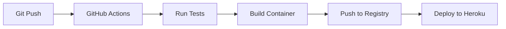

# AI-Powered Slack Bot with RAG System

A sophisticated Slack bot that leverages OpenAI's GPT-4, Redis Stack, and Pinecone for intelligent question answering and conversation management. The bot implements a Retrieval-Augmented Generation (RAG) system to provide accurate, context-aware responses.

## Key Features

- Intelligent question answering using GPT-4
- Efficient caching with Redis Stack for fast responses
- Vector similarity search using Redis and Pinecone
- Thread summarization capabilities
- RAG system for improved response accuracy
- Performance optimization with dual-layer caching

## Technology Stack

### Core Technologies

- NodeJs (≥18.0.0)
- Express
- Slack Bolt Framework
- OpenAI API (GPT-4 & Embeddings)

### Vector Stores & Caching

- Redis Stack (Vector similarity search + Caching)
- Pinecone (Vector database)

### Development Tools

- Babel (ES6+ support)
- ESLint & Prettier
- Jest (Testing)
- Husky (Git hooks)

### Cloud Infrastructure

- GitHub Actions (CI/CD)
- Heroku Container Registry
- Redis Enterprise Cloud
- Pinecone Cloud

## Architecture

The system implements a dual-layer RAG architecture:

1. **First Layer**: Redis Stack for fast, in-memory vector similarity search
2. **Second Layer**: Pinecone for persistent vector storage
3. **Fallback**: OpenAI GPT-4 for generating new responses

## CI/CD Pipeline

The project uses GitHub Actions and Heroku for continuous integration and deployment:

1. **Build Stage**:
   - Runs linting
   - Runs tests
   - Builds Docker image
   - Pushes to Heroku Container Registry

2. **Deploy Stage**:
   - Deploys to Heroku
   - Configures environment variables
   - Sets up service networking

### Deployment Flow



## Performance Optimizations

- Redis Stack implementation for vector similarity search
- Efficient caching strategy for frequently asked questions
- Asynchronous response storage in both Redis and Pinecone
- Optimized vector search with cosine similarity
- Automatic scaling with Heroku
- Container-based deployment

## Setup & Installation

1. Clone the repository:

```
git clone https://github.com/wgod58/slack-bot.git
cd slack-bot
```

2. Install dependencies:

```
yarn install
```

3. Create a `.env` file and set the following environment variables:

```

SLACK_BOT_TOKEN=
OPENAI_API_KEY=
PINECONE_API_KEY=
PINECONE_INDEX_NAME=
REDIS_HOST=
REDIS_USERNAME=
REDIS_PASSWORD=
REDIS_PORT=
PORT=8080
```

4. Start the server:

```
yarn start
```
