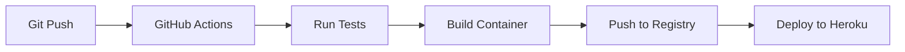
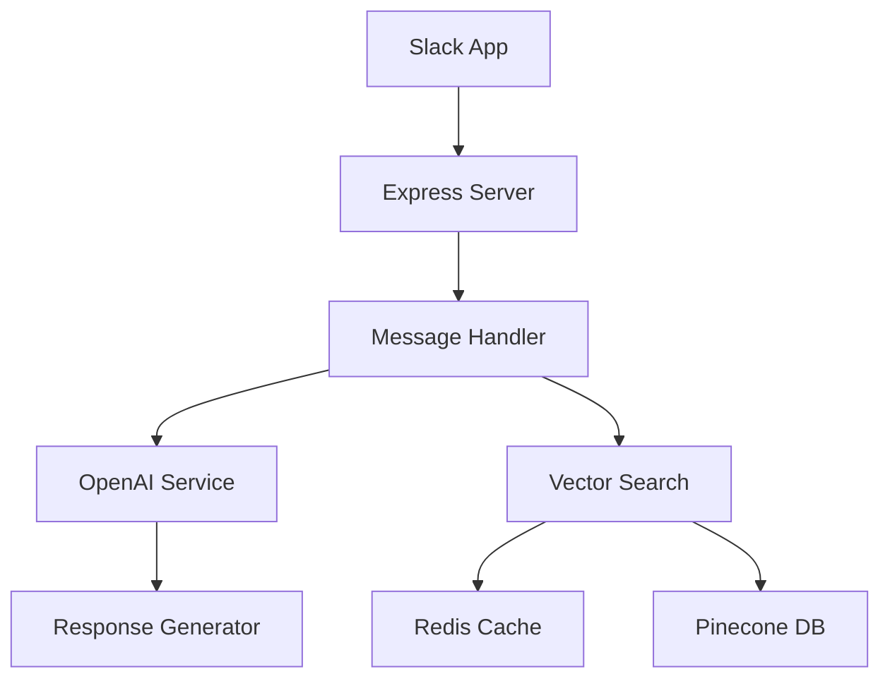

# AI-Powered Slack Bot with RAG System

A sophisticated Slack bot that leverages OpenAI's GPT-4, Redis Stack, and Pinecone for intelligent question answering and conversation management. The bot implements a Retrieval-Augmented Generation (RAG) system to provide accurate, context-aware responses.

## Key Features

- Intelligent question answering using GPT-4
- Efficient caching with Redis Stack for fast responses
- Vector similarity search using Redis and Pinecone
- Thread summarization capabilities
- RAG system for improved response accuracy
- Performance optimization with dual-layer caching

## Technology Stack

### Core Technologies

- NodeJs (≥18.18.0)
- Express
- Slack Bolt Framework
- OpenAI API (GPT-4 & Embeddings)

### Vector Stores & Caching

- Redis Stack (Vector similarity search + Caching)
- Pinecone (Vector database)

### Development Tools

- Babel (ES6+ support)
- ESLint & Prettier
- Jest (Testing)
- Husky (Git hooks)

### Cloud Infrastructure

- GitHub Actions (CI/CD)
- Heroku Container Registry
- Redis Enterprise Cloud
- Pinecone Cloud

## Architecture

The system implements a dual-layer RAG architecture:

1. **First Layer**: Redis Stack for fast, in-memory vector similarity search
2. **Second Layer**: Pinecone for persistent vector storage
3. **Fallback**: OpenAI GPT-4 for generating new responses

## CI/CD Pipeline

The project uses GitHub Actions and Heroku for continuous integration and deployment:

1. **Build Stage**:
   - Runs linting
   - Runs tests
   - Builds Docker image
   - Pushes to Heroku Container Registry

2. **Deploy Stage**:
   - Deploys to Heroku
   - Configures environment variables
   - Sets up service networking

### Deployment Flow



## System Design

### High-Level Architecture



### Components

1. **Slack Integration**
   - Handles real-time message events
   - Manages thread interactions
   - Processes commands and mentions

2. **Vector Search System**
   - **Redis Layer**: Fast, in-memory vector similarity search
     - Stores recent Q&A pairs
     - Handles high-frequency queries
     - Uses consistent hashing for distribution
   - **Pinecone Layer**: Persistent vector storage
     - Maintains historical knowledge base
     - Handles complex similarity searches
     - Distributed across shards using consistent hashing

3. **OpenAI Integration**
   - GPT-4 for response generation
   - Text embeddings for vector search
   - Context-aware response formatting

### Data Flow

1. **Question Processing**

   ```mermaid
   sequenceDiagram
       User->>Slack: Asks Question
       Slack->>Bot: Message Event
       Bot->>OpenAI: Generate Embedding
       Bot->>Redis: Search Similar
       alt Found in Redis
           Redis-->>Bot: Return Cached Response
       else Not Found
           Bot->>Pinecone: Search Similar
           alt Found in Pinecone
               Pinecone-->>Bot: Return Similar Q&A
           else Not Found
               Bot->>OpenAI: Generate New Response
               Bot->>Redis: Cache Response
               Bot->>Pinecone: Store Response
           end
       end
       Bot->>Slack: Send Response
       Slack->>User: Display Response
   ```

### Performance Considerations

- **Caching Strategy**
  - Redis for hot data (recent/frequent queries)
  - Pinecone for cold data (historical knowledge)

- **Scalability**
  - Containerized deployment
  - Automatic horizontal scaling
  - Load balancing across instances

- **Reliability**
  - Fallback mechanisms
  - Error handling and retry logic
  - Monitoring and logging

## Performance Optimizations

- Redis Stack implementation for vector similarity search
- Efficient caching strategy for frequently asked questions
- Asynchronous response storage in both Redis and Pinecone
- Optimized vector search with cosine similarity
- Automatic scaling with Heroku
- Container-based deployment

## System Bottlenecks & Future Improvements

### Current Bottlenecks

1. **API Rate Limits**
   - OpenAI API request limits
   - Slack API message limits
   - Pinecone query throughput limits

2. **Data Distribution**
   - Hot spots in data access
   - Uneven load distribution
   - Cross-node query coordination

3. **Latency Issues**
   - Network latency with external APIs
   - Vector search computation time
   - Sequential processing of embeddings

4. **Resource Constraints**
   - Redis memory limitations
   - Container resource limits
   - Concurrent request handling

### Planned Improvements

1. **Performance Optimization**

   ```mermaid
   graph TD
       A[Current System] --> B[Improvements]
       B --> C[Caching]
       B --> D[Processing]
       B --> E[Architecture]
       C --> F[Enhanced Redis Caching]
       C --> G[Consistent Hashing]
       C --> G[Response Precomputation]
       D --> I[Parallel Embeddings]
       E --> J[Message Queue]
       E --> K[Load Balancer]
   ```

2. **Feature Enhancements**
   - Implement message queue system (RabbitMQ/Redis)
   - Add consistent hashing for distributed caching
   - Introduce response precomputation
   - Implement adaptive caching strategies (LFU or LRU)

3. **Scalability Improvements**
   - Horizontal scaling of worker nodes
   - Distributed vector search on Redis and Pinecone
   - Consistent hashing for data distribution
   - Regional data replication
   - Load balancing improvements

4. **Monitoring & Reliability**
   - Enhanced error tracking
   - Performance metrics dashboard
   - Automated failover systems
   - A/B testing infrastructure

### Distributed System Architecture

1. **Consistent Hashing Implementation**

   ```mermaid
   graph TD
       A[Question Input] --> B[Hash Function]
       B --> C[Hash Ring]
       C --> D{Node Selection}
       D --> E[Redis Node 1]
       D --> F[Redis Node 2]
       D --> G[Redis Node N]
       D --> H[Pinecone Shard 1]
       D --> I[Pinecone Shard 2]
       D --> J[Pinecone Shard N]
   ```

2. **Key Distribution Strategy**
   - Virtual nodes for better distribution
   - Minimal redistribution on node changes
   - Configurable replication factor

3. **Benefits**
   - Even data distribution
   - Automatic scaling
   - Minimal data movement
   - High availability

### Implementation Priority

1. **Short-term**
   - Advanced caching strategies (LFU or LRU)
   - Message queue implementation
   - Enhanced error handling
   - Improved monitoring

2. **Mid-term**
   - Response precomputation
   - Regional replication

3. **Long-term**
   - Distributed vector search on Redis and Pinecone
   - Full observability system

## Setup & Installation

1. Clone the repository:

```
git clone https://github.com/wgod58/slack-bot.git
cd slack-bot
```

2. Install dependencies:

```
yarn install
```

3. Create a `.env` file and set the following environment variables:

```
SLACK_BOT_TOKEN=
OPENAI_API_KEY=
PINECONE_API_KEY=
PINECONE_INDEX_NAME=
REDIS_HOST=
REDIS_USERNAME=
REDIS_PASSWORD=
REDIS_PORT=
PORT=8080
```

4. Start the server:

```
yarn start
```
