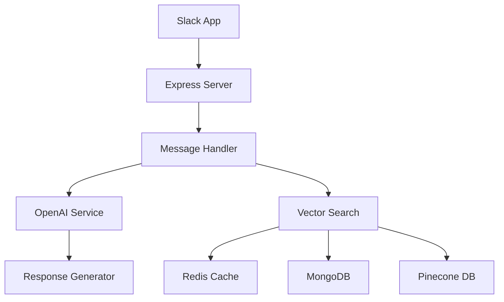

# AI-Powered Slack Bot with RAG System

A sophisticated Slack bot that leverages OpenAI's GPT-4, Redis Stack, and Pinecone for intelligent question answering and conversation management. The bot implements a Retrieval-Augmented Generation (RAG) system to provide accurate, context-aware responses.

## Key Features

- Intelligent question answering using GPT-4
- Efficient caching with Redis Stack for embedding messages and OpenAI response cache
- MongoDB for persistent storage of embedding messages
- Vector similarity search in Redis and Pinecone
- Thread summarization capabilities
- Performance optimization with dual-layer caching

## Technology Stack

### Core Technologies

- NodeJs (≥18.18.0)
- Express
- Slack Bolt Framework
- OpenAI API (GPT-4 & Embeddings)
- Redis Stack (Cache embedding messages and OpenAI response)
- Pinecone (Vector database)
- MongoDB (Store embedding messages)
- Docker

### Development Tools

- Babel (ES6+ support)
- ESLint & Prettier
- Jest (Testing)
- Husky (Git hooks)
- GitHub Actions (CI/CD)
- Heroku (Deployment)

## Architecture

The system implements a dual-layer RAG architecture:

1. **First Layer**: Redis Stack. Caching embedding messages and caching OpenAI response
2. **Second Layer**: MongoDB. Store embedding messages to prevent Redis eviction policy clean up
3. **Third Layer**: Pinecone for similarity search and persistent vector storage
4. **Fallback**: OpenAI GPT-4 for generating new responses

## CI/CD Pipeline

The project uses GitHub Actions and Heroku for continuous integration and deployment:

1. **Test Stage**:
   - Runs linting
   - Runs tests

2. **Deploy Stage**:
   - Builds Docker image
   - Pushes to Heroku Container Registry
   - Deploys to Heroku
   - Configures environment variables
   - Sets up service networking

## System Design

### High-Level Architecture



### Components

1. **Slack Integration**
   - Handles real-time message events
   - Manages thread interactions
   - Processes commands and mentions

2. **Vector Search System**
   - **Redis Layer**: Fast, search in cache
     - Caching of embedding messages
     - Caching of OpenAI response
     - Handles high-frequency queries
   - **Pinecone Layer**: Persistent vector storage
     - Maintains historical knowledge base
     - Handles complex similarity searches

3. **OpenAI Integration**
   - GPT-4 for response generation
   - Text embeddings for vector search
   - Context-aware response formatting

4. **Document Storage**
    - MongoDB for persistent storage
    - Stores embeddings and metadata
    - Handles data relationships

### Data Flow

1. **Question Processing**

   ```mermaid
   sequenceDiagram
       User->>Slack: Asks Question
       Slack->>Bot: Message Event
       Bot->>Redis: Search embedding messages vector value
       alt Found in Redis
           Redis-->>Bot: Return Cached Embedding
       else Not Found
           Bot->>MongoDB: Search embedding messages
           alt Found in MongoDB
               MongoDB-->>Bot: Return Embedding
               MongoDB->>Redis: Store Embedding
           else Not Found
               Bot->>OpenAI: Generate Embedding
               OpenAI->>MongoDB: Store Embedding
               OpenAI->>Redis: Store Embedding
           end
       end
       Bot->>Redis: Search similar vector value
       alt Found in Redis
           Redis-->>Bot: Return Cached Response
           Bot->>Slack: Send Response
       else Not Found
           Bot->>Pinecone: Search Similar
           alt Found in Pinecone
               Pinecone-->>Bot: Return Similar Q&A
               Pinecone->>Redis: Store Similar Q&A
           else Not Found
               Bot->>OpenAI: Generate New Response
               OpenAI->>Redis: Store Response
               OpenAI->>Pinecone: Store Response
           end
       end
       Bot->>Slack: Send Response
       Slack->>User: Display Response
   ```

## System Bottlenecks & Future Improvements

### Current Bottlenecks

- Redis memory limitations
- MongoDB storage limitations
- System resource limitations (CPU, Memory, etc.)
- OpenAI API request limits
- Hot spots in data access
- Network latency with external APIs
- Concurrent request handling

### Planned Improvements

1. **Performance Optimization**

   ```mermaid
   graph TD
       A[Current System] --> B[Improvements]
       B --> C[Caching]
       B --> D[Processing]
       B --> E[Architecture]
       C --> F[Consistent Hashing Enhanced Redis Caching]
       C --> G[Distributed MongoDB Storage]
       C --> H[Consistent Hashing Enhanced Pinecone Caching]
       D --> I[Precompute Embeddings and Responses]
       E --> J[Message Queue]
       E --> K[Load Balancer]
   ```

2. **Feature Enhancements**
   - Implement message queue system (RabbitMQ/Kafka)
   - Add consistent hashing for distributed caching
   - Introduce response precomputation

3. **Scalability Improvements**
   - Distributed vector search on Redis and Pinecone
   - Consistent hashing for data distribution
   - Regional data replication
   - Load balancing improvements
   - Regional data replication and service deployment and failover

4. **Monitoring & Reliability**
   - Enhanced error tracking
   - Monitoring metrics dashboard and alerting
   - Automated failover systems

## Setup & Installation

1. Clone the repository:

```
git clone https://github.com/wgod58/slack-bot.git
cd slack-bot
```

2. Install dependencies:

```
yarn install
```

3. Create a `.env` file and set the following environment variables:

```
SLACK_BOT_TOKEN=
OPENAI_API_KEY=
PINECONE_API_KEY=
PINECONE_INDEX_NAME=
REDIS_HOST=
REDIS_USERNAME=
REDIS_PASSWORD=
REDIS_PORT=
PORT=8080
```

4. Start the server:

```
yarn start
```
