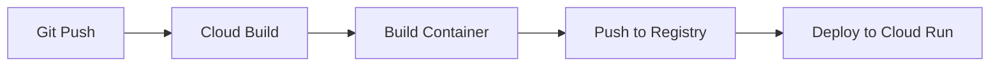

# AI-Powered Slack Bot with RAG System

A sophisticated Slack bot that leverages OpenAI's GPT-4, Redis Stack, and Pinecone for intelligent question answering and conversation management. The bot implements a Retrieval-Augmented Generation (RAG) system to provide accurate, context-aware responses.

## Key Features

- Intelligent question answering using GPT-4
- Efficient caching with Redis Stack for fast responses
- Vector similarity search using Redis and Pinecone
- Thread summarization capabilities
- RAG system for improved response accuracy
- Performance optimization with dual-layer caching

## Technology Stack

### Core Technologies

- NodeJs (≥18.0.0)
- Express
- Slack Bolt Framework
- OpenAI API (GPT-4 & Embeddings)

### Vector Stores & Caching

- Redis Stack (Vector similarity search + Caching)
- Pinecone (Vector database)

### Development Tools

- Babel (ES6+ support)
- ESLint & Prettier
- Jest (Testing)
- Husky (Git hooks)

### Cloud Infrastructure

- Google Cloud Platform (GCP)
  - Cloud Build (CI/CD)
  - Cloud Run (Serverless deployment)
  - Artifact Registry (Container registry)
- Redis Enterprise Cloud
- Pinecone Cloud

## Architecture

The system implements a dual-layer RAG architecture:

1. **First Layer**: Redis Stack for fast, in-memory vector similarity search
2. **Second Layer**: Pinecone for persistent vector storage
3. **Fallback**: OpenAI GPT-4 for generating new responses

## CI/CD Pipeline

The project uses GCP Cloud Build for continuous integration and deployment:

1. **Build Stage**:

   - Runs tests
   - Builds Docker image
   - Pushes to Artifact Registry

2. **Deploy Stage**:
   - Deploys to Cloud Run
   - Configures environment variables
   - Sets up service networking

### Deployment Flow



## Performance Optimizations

- Redis Stack implementation for vector similarity search
- Efficient caching strategy for frequently asked questions
- Asynchronous response storage in both Redis and Pinecone
- Optimized vector search with cosine similarity
- Serverless scaling with Cloud Run
- Global distribution with Cloud Run locations

## Setup & Installation

1. Clone the repository:

```

## Deployment

### Environment Variables

Required environment variables:
```

SLACK_BOT_TOKEN=
SLACK_SIGNING_SECRET=
SLACK_APP_TOKEN=
OPENAI_API_KEY=
PINECONE_API_KEY=
PINECONE_INDEX_NAME=
REDIS_HOST=
REDIS_USERNAME=
REDIS_PASSWORD=
REDIS_PORT=
PORT=8080

````

### CI/CD Pipeline

The project uses GitHub Actions for CI/CD:

1. **CI Stage**:
   - Runs linting
   - Runs tests
   - Builds application

2. **CD Stage**:
   - Builds Docker image
   - Deploys to Heroku

### Manual Deployment

```bash
# Login to Heroku
heroku login

# Push to Heroku
git push heroku main

# View logs
heroku logs --tail
````
